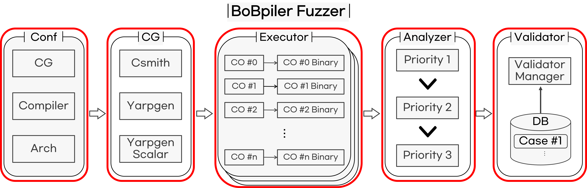
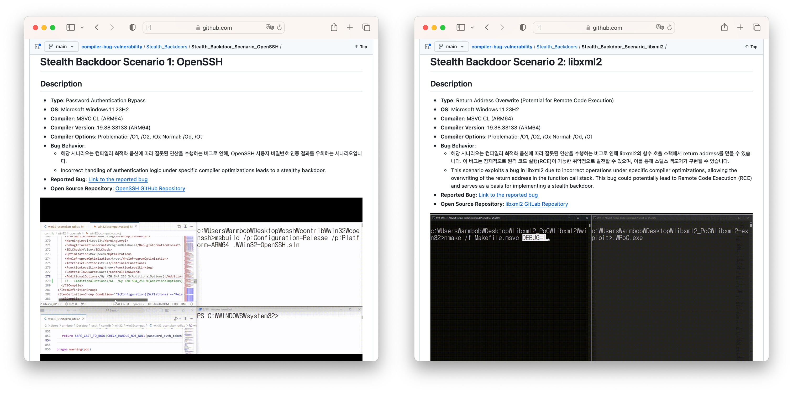
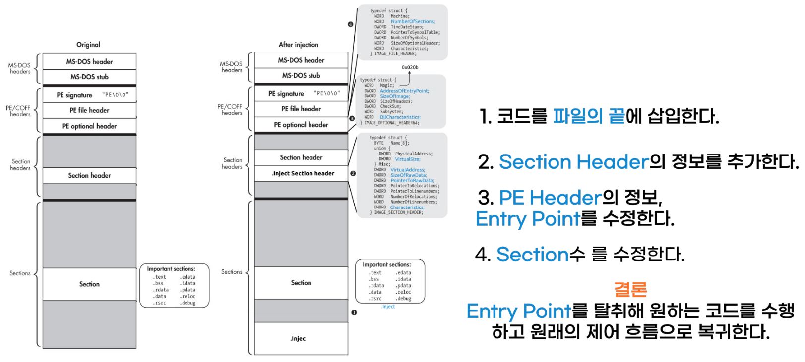
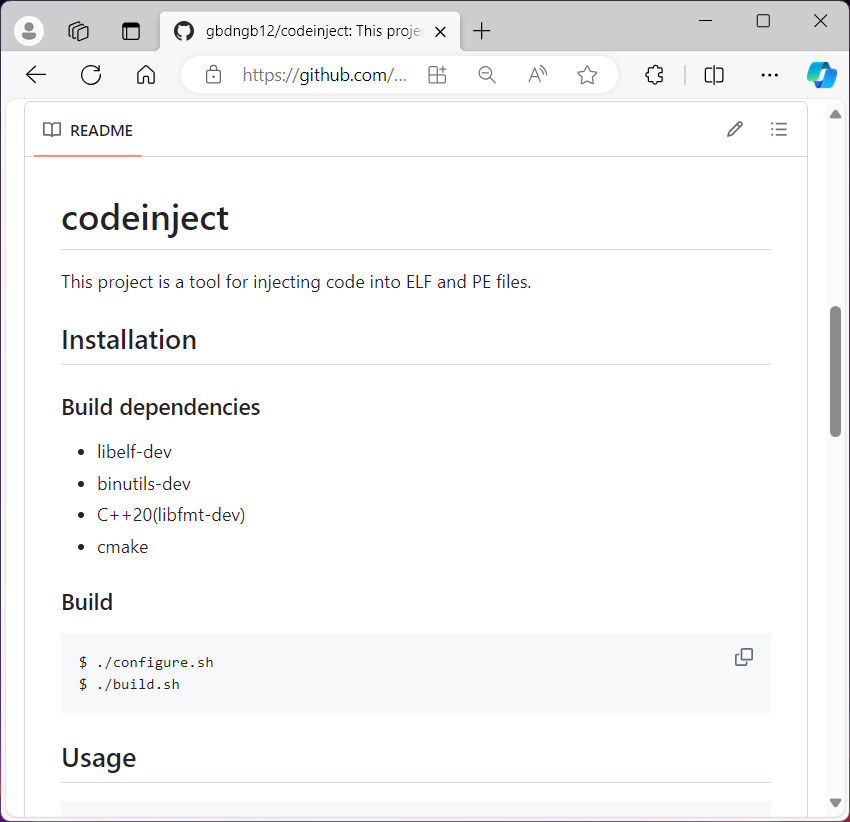
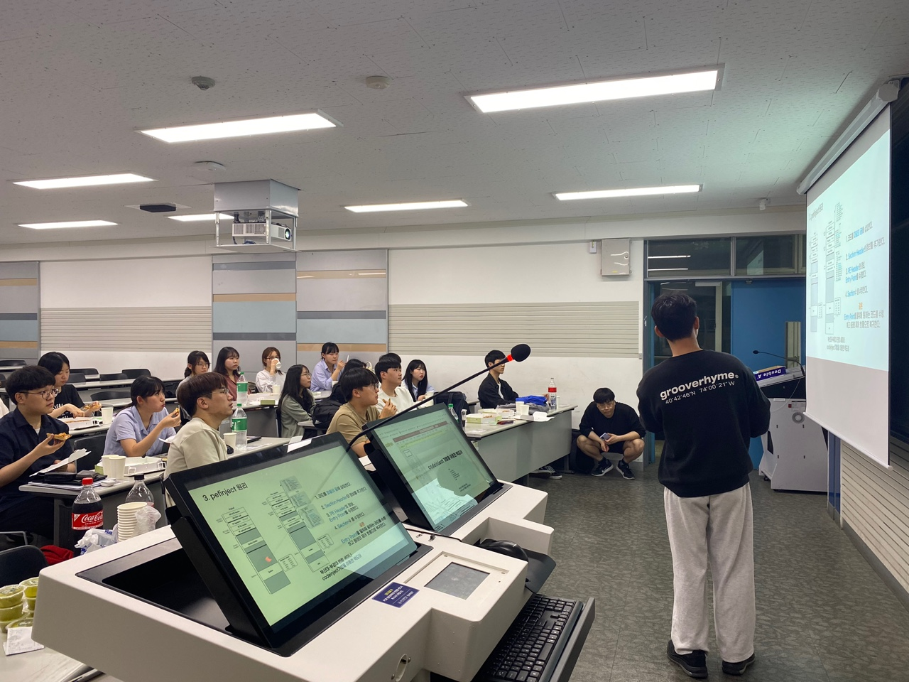

# `$ whoami`

## 자기 소개

#
#
#
#
안녕하세요.
문제를 **주도적으로 찾고**,
**주어진 문제를 끈기 있게 해결**하는 김동건 입니다!

## 보유 기술

- **`C`**/ **`C++`** / **`Python`** / `HTML/CSS/JS` / `Java/Kotlin`
- **`x86`, `ARM64`, `MIPS64`**, `s390x`
- `docker`, `Git`

## 학력 및 이력
- 부경대학교 **컴퓨터공학전공** 
    (2018.03 ~ 2025.02 졸업 예정)
- KITRI **BoB 취약점 분석 12기**
    (**컴파일러 최적화 취약점 분석 PM**)
- **`codeinject` 
도구 프로젝트** 및 **세미나 발표**
- **CTF 대회** 출전 
    (`UofTCTF 2024`, `Insomni'hack`, 
    `hspace CTF`)

## [GitHub Link(gbdngb12)](https://github.com/gbdngb12)

---

# `$ Compiler Optimization Vulnerability Analysis`

## 컴파일러 최적화 취약점 분석 프로젝트 요약

| 항목&nbsp;&nbsp;&nbsp;&nbsp;&nbsp;&nbsp;&nbsp;&nbsp;&nbsp;&nbsp; | 내용 |
|:-----|:-----|
| **프로젝트 기간** | 2023.09 ~ 2023.12 (4개월) |
| **진행 배경** | 컴파일러 최적화 과정은 매우 복잡, 의도하지 않은 취약점 분석 |
| **역할** | **PM**, 프로젝트 총괄 및 발표 (총 6명) |
| **기술적 핵심 내용** | 컴파일러 **Fuzzer 개발** 및 **CodeQL**, 최적화 버그 취약점 연계 |
| **프로젝트 성과** | 컴파일러 버그 31건, 학술대회 논문 2개, Stealth Backdoor 시나리오 연구, PoC 3개 개발, CodeQL Query 9개 개발 |
| **프로젝트 링크** | [GitHub](https://bobpiler.github.io/compiler-optimization-vulnerability-explorations/) |

<!-- 음 핵심 정리 내용
- 프로젝트 내용
- 프로젝트 기간
- 프로젝트 진행 배경
- 프로젝트내의 역할
- 프로젝트 기술적 핵심 내용
- 프로젝트 성과
- 프로젝트 링크 -->

---

# `$ Compiler Optimization Vulnerability Analysis`

## 프로젝트 핵심 내용 : `Fuzzer`

`*CG: Code Generator, *Arch: Architecture, *CO: Compile Options`

  

CG에서 생성된 코드가 **Executor**에서 컴파일 및 실행, **Analyzer, Validator**에서 버그 탐지

---

# `$ Compiler Optimization Vulnerability Analysis`

## 프로젝트 성과 : `Conference Paper Submission, Vulnerability PoC Using Compiler Bugs, CodeQL Query`

학술대회 논문 투고, 컴파일러 최적화 버그가 취약점으로 연결 될 수 있음을 증명하는 PoC 개발, 컴파일러 최적화 버그를 탐지하는 CodeQL Query 개발

<image src="image/paper_poc_codeql.png" height=500px></image>

---

# `$ Compiler Optimization Vulnerability Analysis`

## 프로젝트 성과 : `Stealth Backdoor Scenario`

악의적인 공격자가 **컴파일러 최적화 버그**를 이용해서 오픈소스에 **코드를 삽입**할 경우 
특정한 컴파일러, 아키텍쳐, 최적화 옵션에서 취약점을 유발하는 시나리오 연구

---

# `$ Development codeinject Tool`

## `codeinject` 도구 개발 프로젝트 요약

| 항목&nbsp;&nbsp;&nbsp;&nbsp;&nbsp;&nbsp;&nbsp;&nbsp;&nbsp;&nbsp; | 내용 |
|:-----|:-----|
| **프로젝트 기간** | 2023.05 ~ 2023.06 (1개월) |
| **진행 배경** | **ELF, PE**, 객체지향 **C++** 학습 및 악성코드 도구 개발 |
| **역할** | 개인 프로젝트 |
| **기술적 핵심 내용** | ELF, PE 구조, C++, Linux/Windows Loader의 역할, 클래스 다이어그램 |
| **프로젝트 성과** | **`codeinject` 도구**, 부산대-부경대 **세미나 발표** |
| **프로젝트 링크** | [GitHub](https://github.com/gbdngb12/codeinject.git) |

---

# `$ Development codeinject Tool`

## 프로젝트 핵심 내용 : `Class Diagram`,

## `Principle Study`

## 

---

# `$ Development codeinject Tool`

## 프로젝트 성과 : `codeinject Tool`, `Seminar Presentation`

# 
#
#
#

#
#
#
#

---

# `$ CTF`

## 지속적인 CTF 대회 출전 : `UofTCTF 2024`, `Insomni'hack`, `hspace CTF`

#
#
#
#

 
<image src="image/CTF.png"></image>

올해에 열린 **CTF대회에 출전**함으로써 **`pwnable` 기술**을 공부하며, 취약점을 찾고 **expolit**할 준비를 하고 있습니다 !

#
#
#

 
<image height=450px src="image/dream_hack.png"></image>

---

# `Future Plan`

## `1. Study Binary Fuzzing`
바이너리 Fuzzing에 대한 공부 및 Fuzzing 진행

## `2. Analysis 1-Day Vulnerability`
기존 취약점 1-Day 분석 진행

## `3. Find Real World Major Program Vulnerability`
리얼 월드에서 메이저 프로그램의 취약점 찾기

#
#
#
#
#
#
#
#
#
#
#
#
#
#
#
#
#
## 김동건
### Email : gbdngb12@naver.com
### GitHub : https://github.com/gbdngb12

#
#
#
#
#
#
#
#
#
#
#
#
#
#
#
#
#
#
#
### 꾸준하게 하자.

<!-- #### 꾸준하게 하자. -->

<!-- # `$ Compiler Optimization Vulnerability Analysis`

## 프로젝트 성과 : `CodeQL Query for Compiler Bug Detection`

컴파일러 최적화 버그를 탐지하는 **`CodeQL Query`**

<image align="center" src="image/codeql.png" height=400px>

</image> -->

<!-- 
# `$ Compiler Optimization Vulnerability Analysis`

## 진행 배경

  

- **컴파일러 최적화 과정**은 매우 복잡하며, 다양한 아키텍쳐를 지원합니다.
- 이러한 이유로 **컴파일러 최적화 버그**가 발생할 수 있습니다.
- 이는 **곧 바이너리의**  잠재적인 보안 취약점으로 **연결** 될 수 있으므로 프로젝트를 진행했습니다.

--- -->
<!-- 
# `$ Compiler Optimization Vulnerability Analysis`

## 프로젝트 핵심 내용 : `Overview`

  

- 컴파일러 최적화 버그를 탐지하는 **Fuzzer를 개발**하여 **컴파일러 최적화 버그 탐지 및 분석**
- 컴파일러 최적화 버그와 **바이너리 취약점 연계**
    - CodeQL을 활용한 취약점 진단
    - 컴파일러 최적화버그가 취약점을 유발 할 수 있음을 증명하는 PoC 개발

--- -->